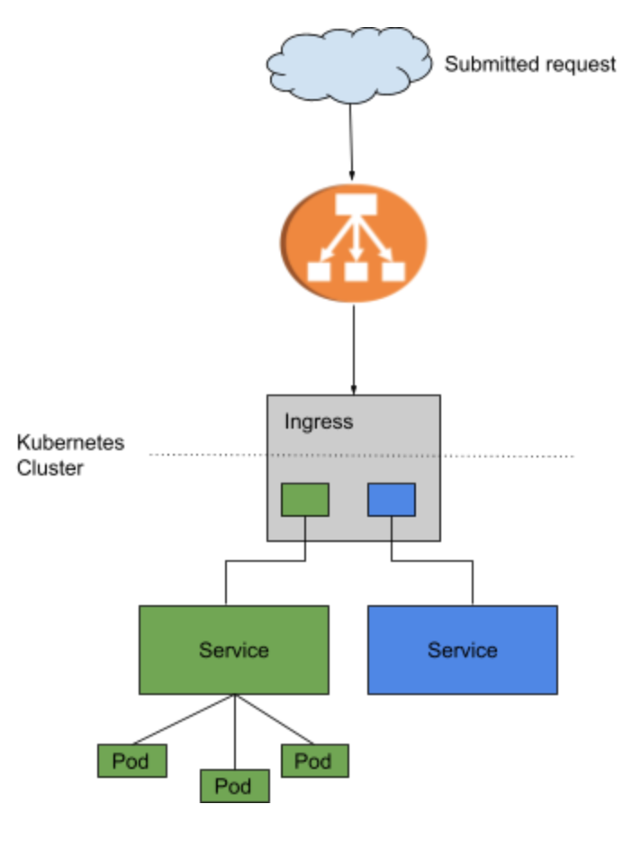
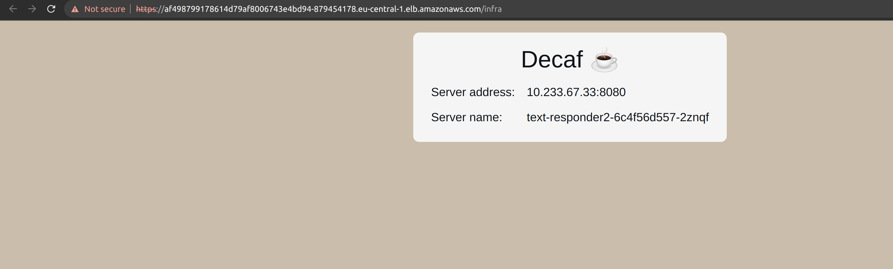

# kubernetes-cluster-demo

## Managed Kubernetes vs self-managed Kubernetes

### Overview 🔧

Kubernetes clusters can be controlled by the user (self-managed) or by a cloud service provider (Provider managed Kubernetes). Also, the first issue most teams ask themselves when planning a Kubernetes installation is whether to employ a managed Kubernetes service – such as Amazon AKS, Azure Kubernetes Service, or another public cloud-based Kubernetes platform – or to deploy and operate Kubernetes on their own infrastructure. Kubernetes provider handles at least some of the provisioning and maintenance duties required to keep clusters running. Therefore, a managed Kubernetes service is nearly always easier to set up and maintain.

Moreover, it is worth mentioning that managed Kubernetes design relies on vendor-owned tools and (in most instances) infrastructure since it has the security disadvantage of limiting the degree of control and privacy that users may obtain. Moreover, if you do not have a compelling technical or legal reason to use an on-premises self-managed cluster, consider a managed Kubernetes service. Self-managed clusters necessitate a high level of specialized expertise among your staff, as well as continuous infrastructure and maintenance costs.

In order to demonstrate the advantages and disadvantages of managed kubernetes and self managed kubernetes, we will create a self managed kubernetes cluster with Kops. In addition, some alternatives to launching kubernetes clusters on bare-metal servers will be briefly introduced for Kubernetes clusters with metal-stack such as:
- [Cluster API](https://metal-stack.io/blog/2021/03/cluster-api-provider/).
- [Gardener](https://gardener.cloud/).

### What does it mean to have "managed Kubernetes"? 

Despite the fact that Kubernetes is free source, many firms who want to use it don't have the skills or resources to set up and manage the cluster. Managed Kubernetes providers assist those interested in using Kubernetes by providing the necessary support and management for Kubernetes clusters. A managed Kubernetes deployment should offer users a painless control plane, simple deployment options, and ongoing Kubernetes maintenance, allowing them to focus on their company and getting their apps to market.

Many cloud providers offer managed Kubernetes services, however the configuration options and degree of support they provide to their customers vary slightly.

A managed Kubernetes cluster is preferable to a self-managed one if we take the following into consideration:

- A single cloud
- You do not require the most recent Kubernetes releases.
- You're ready to delegate vulnerability patching to your cloud provider.


### Self Managed Clusters 📋

You have control over the management layer on a self-managed Kubernetes Cluster, whereas the master is handled by the provider in a fully managed kubernetes service not allowing you to configure it at all. Moreover, you get complete access to the cluster master and all other related management components when you deploy your own cluster using kubeadm, kubespray, Kops or even the hard way.

This also gives configuration flexibility, allowing you to setup the cluster and nodes however you wish, rather than having to deal with the configuration options allowed by a managed service.

#### Kubernetes tools to Create and Control Clusters 📖
among the tools used to spawn and manage a kubernetes clusters, hereby I have listed some of them:
- Kubeadm – a toolkit providing the best-practice ways to create Kubernetes clusters. It is aimed at ensuring a quick and easy set up of the minimum viable cluster.
- Kubespray – a composition of Ansible tools for performing configuration and deployment-related tasks. It is compatible with any cloud service provider and is backed by Kubeadm.
- Kubewatch – a native watcher running in the cluster that monitors any changes in the system and publishes notifications in communication channels.
- Kubetail – a bash script allowing to “tail” logs into a single stream from many pods.
- Istio – an open-source platform ensuring secure and manageable traffic flow, microservices integration, as well as telemetry data integration.
- HELM – a tool that allows users to manage the so-called Helm charts (Kubernetes packaged resources). You can find popular charts or create new ones for your application.
- Kops – a tool for creating/deleting, controlling, and upgrading production-based clusters from the command line. It is used to manage the Kubernetes cluster’s entire life cycle.
- Kubernetes Dashboard – a web-based user interface that allows users to control and troubleshoot the apps in the cluster, as well as monitor the whole cluster.
- Prometheus – a monitoring & analyzing system which is extremely useful and informative while being simple to integrate and use.

#### Kubernetes clusters on bare-metal servers with metal-stack

##### Metal-Stack

Regarding the management and access of data and computing resources in any regulated enterprise, there are security concerns and rules one has to take into account for data protection and ownership. Thus, using the public cloud isn't appropriate for all workloads. As a result, identifying an enterprise-ready stack for our own datacenter, as well as creating cloud native digital competency criteria are key tasks we ought to tackle for regulated enterprises.

Besides, Metal-stack is a piece of open source software that provides an API for provisioning and managing physical servers in a data center. We refer to this product as Metal-as-a-Service (MaaS) or bare metal cloud. It is also known as an IaaS provider for bare metal focused on creating on-premise Kubernetes clusters. 

Key advantages of using kubernetes on bare-metal servers:
- Performance & predictability
- Hardware compatibility and flexibility
- Security and management

##### Kubernetes Clusters-as-a-Service

There are numerous Open Source tools available to assist in the creation and maintenance of single Kubernetes clusters. However, the more clusters you require, the more difficult it is to operate, monitor, manage, and keep them all alive and up to date. That is precisely the focus of projects such as [Gardener](https://gardener.cloud/) and [Cluster API](https://metal-stack.io/blog/2021/03/cluster-api-provider/), which are designed to manage Kubernetes clusters as a service, rather than just another provisioning tool. It offers Kubernetes-compliant clusters on a variety of cloud providers and bare-metal infrastructure, as well as the flexibility to expand hundreds or thousands of them.

Some alternatives for managing kubernetes cluster on metal-stack:

- Cluster API

The Kubernetes Special Interest Group (SIG) Cluster Lifecycle started Cluster API with the purpose of making deploying, updating, and operating numerous Kubernetes clusters easier. It uses Kubernetes-style APIs to automate cluster lifecycle management in this way. Clusters and nodes can be managed similarly as with Pods and Deployments.

Besides, there is a Cluster resource for managing clusters, a Machine resource (similar to the Pod resource for apps) and a MachineDeployment resource for managing machines (comparable to the Deployment resource for apps).

For more information on Cluster API, go to [Cluster API](https://metal-stack.io/blog/2021/03/cluster-api-provider/).

- Gardener

It's built to scale to tens of thousands of clusters at a number of IaaS providers, regardless of whether they're in the cloud or on premise, virtualized or bare metal. It not only manages the construction and deletion of Kubernetes clusters, but it also handles the automatic updating or upgrading of Kubernetes and the operating system of the worker nodes. Gardener is built in such a way that it specifies clusters, workers, and all other components as Kubernetes resources (such as pods and deployments) and brings them back to the desired state.

[Kubernetes Cloud Controller Manager](https://github.com/metal-stack/metal-ccm) and [Gardener extension provider](https://github.com/metal-stack/gardener-extension-provider-metal) can be used to make Kubernetes work well with metal-stack. Failed machines will be immediately replaced with this in place, and you may even use the Kubernetes cluster autoscaler for automatic bare-metal server provisioning.

For learning more about Gardener, go to [Gardener](https://gardener.cloud/).

### kops stands for Kubernetes Operations.
"We like to think of it as kubectl for clusters," says the kops GitHub website. kops is a command line interface (CLI) tool that has implemented the major verbs of cluster management. 

Among the traits that make kops appealing are:

- Much more automated than Kubernetes "the hard way":
- It features configuration parameters that are externalized and modifiable.
- Updates to Kubernetes configuration parameters are used.
- Deploying Kubernetes primary nodes in high-availability (HA) mode is made easier.
- Upgrades to Kubernetes versions are supported.
- For dry-runs, a state-sync model was used, as well as automated idempotency.
- Terraform configuration generation capability
- Custom kubectl add-ons are supported.

### Infrastructure details

 [[1]](https://aws.amazon.com/blogs/opensource/network-load-balancer-nginx-ingress-controller-eks/)

### Prerequisites 📋
- Kops (v1.22.3+)
- Ansible (v2.10.15+)
- AWS account
- A dns domain
- Python Libraries: boto3, jinja2

### Deployment 
- Clone this repo in your local environment:
```
git clone https://github.com/x-cellent/kubernetes-cluster-demo
```
- Create a domain for your cluster, otherwise you can use a gossip based domain

- Make sure to export your amazon credentials
```
export AWS_ACCESS_KEY_ID="YOUR_AMAZON_ACCESS_KEY"
export AWS_SECRET_ACCESS_KEY="YOUR_AMAZON_SECRET_ACCESS_KEY"
export AWS_SESSION_TOKEN="YOUR_AMAZON_SESSION_TOKEN"
```
- change infrastructure details for kops scripts.
```
cat group_vars/all/vars.yaml
cluster_name: kops-xc.xc-cloud.net #kub-xcellent.xc-cloud.net
#cluster_name: kubernetes.xc-cloud.net
state_store: s3://kops-cluster-xc-test

## Remote access
ssh_public_key: ~/.ssh/id_rsa.pub


## Regions / Availability zones
aws_region: eu-central-1
aws_zones: eu-central-1a,eu-central-1b,eu-central-1c
# Use master_zones if you want your masters in different zones than worker nodes.
# Useful especially when you want 1 master in single zone but workers in several zones.
# When not defined, aws_zones will be sued instead
master_zones: eu-central-1a,eu-central-1b,eu-central-1c
#master_zones: eu-central-1a


## Network
dns_zone: kops-xc.xc-cloud.net
network_cidr: 172.16.0.0/16
kubernetes_networking: amazonvpc
#kubernetes_networking: amazon-vpc-routed-eni 
#kubernetes_networking: weave
# Topology must be either public or private
topology: private
bastion: true

# Master configuration
master_size: t2.small
master_count: 3
#master_volume_size: 50
# Use master_max_price if you want to use spot instances.
# Useful to reduce cost during testing
#master_max_price: 0.05
# Use master_profile if you want custom iam policies
#master_profile: arn:aws:iam::1234567890108:instance-profile/kops-custom-master-role

# Node configuration
node_size: t2.small
node_count: 3

```

- Create S3 bucket to store kops cluster state
```
ansible-playbook create-s3.yaml
```

- You can add and/or delete add-ons such as autoscaling, metrics server, etc, by adding them into [config_addons.yml](https://github.com/x-cellent/kubernetes-cluster-demo/blob/main/config_addons.yml)
```
certManager:
  enabled: true
metricsServer:
  enabled: true
  insecure: false

awsLoadBalancerController:
  enabled: true

additionalPolicies:
  master: |
    [
      {
        "Effect": "Allow",
        "Action": [
          "autoscaling:DescribeAutoScalingGroups",
          "autoscaling:DescribeAutoScalingInstances",
          "autoscaling:DescribeLaunchConfigurations",
          "autoscaling:DescribeTags",
          "autoscaling:SetDesiredCapacity",
          "autoscaling:TerminateInstanceInAutoScalingGroup",
          "elasticloadbalancing:ModifyLoadBalancerAttributes",
          "acm:ListCertificates",
          "acm:DescribeCertificate",
          "autoscaling:DescribeAutoScalingGroups",
          "autoscaling:DescribeLoadBalancerTargetGroups",
          "autoscaling:AttachLoadBalancers",
          "autoscaling:DetachLoadBalancers",
          "autoscaling:DetachLoadBalancerTargetGroups",
          "autoscaling:AttachLoadBalancerTargetGroups",
          "cloudformation:*",
          "elasticloadbalancing:*",
          "elasticloadbalancingv2:*",
          "ec2:DescribeInstances",
          "ec2:DescribeSubnets",
          "ec2:DescribeSecurityGroups",
          "ec2:DescribeRouteTables",
          "ec2:DescribeVpcs",
          "iam:GetServerCertificate",
          "iam:ListServerCertificates"
        ],
        "Resource": ["*"]
      }
    ]
  node: |
    [
      {
        "Effect": "Allow",
        "Action": [
          "autoscaling:DescribeAutoScalingGroups",
          "autoscaling:DescribeAutoScalingInstances",
          "autoscaling:DescribeLaunchConfigurations",
          "autoscaling:DescribeTags",
          "autoscaling:SetDesiredCapacity",
          "autoscaling:TerminateInstanceInAutoScalingGroup",
          "elasticloadbalancing:ModifyLoadBalancerAttributes",
          "acm:ListCertificates",
          "acm:DescribeCertificate",
          "autoscaling:DescribeAutoScalingGroups",
          "autoscaling:DescribeLoadBalancerTargetGroups",
          "autoscaling:AttachLoadBalancers",
          "autoscaling:DetachLoadBalancers",
          "autoscaling:DetachLoadBalancerTargetGroups",
          "autoscaling:AttachLoadBalancerTargetGroups", 
          "cloudformation:*",
          "elasticloadbalancing:*",
          "elasticloadbalancingv2:*",
          "ec2:DescribeInstances",
          "ec2:DescribeSubnets",
          "ec2:DescribeSecurityGroups",
          "ec2:DescribeRouteTables",
          "ec2:DescribeVpcs",
          "iam:GetServerCertificate",
          "iam:ListServerCertificates"
        ],
        "Resource": ["*"]
      }
    ]
clusterAutoscaler:
  awsUseStaticInstanceList: false
  balanceSimilarNodeGroups: false
  cpuRequest: 50m
  enabled: true
  expander: least-waste
  memoryRequest: 50Mi
  newPodScaleUpDelay: 0s
  scaleDownDelayAfterAdd: 10m0s
  scaleDownUtilizationThreshold: "0.5"
  skipNodesWithLocalStorage: false
  skipNodesWithSystemPods: false

kubelet:
  anonymousAuth: false
  authorizationMode: Webhook
  authenticationTokenWebhook: true
```

Create cluster
```
ansible-playbook create.yaml
```

Moreover, the kubectl profile will be added automatically and it will take some minutes to initialize.

#### LB deployment

Running a containerized application frequently necessitates access to network services in order to route external traffic to the Kubernetes cluster. Network services, like Kubernetes deployments, are typically run at the frontend of the application, handling uneven routing while providing an abstract way to dynamically access a group of services in the Kubernetes cluster.

#### Ingress Solutions within a Cluster

In-cluster ingress solutions have the advantage of being readily scaled with the Kubernetes environment because they are defined as a pod in the Kubernetes cluster. In addition, cloud providers have little influence on cluster ingress solutions. Moreover, they are typically open-source, facilitating the choice for an ingress controller that best matches the organization's load balancing and security requirements.

GLBC (GCE L7 Load Balancer) and ingress-nginx controllers are currently supported by default in Kubernetes. Ingress controllers must be installed separately from these controllers prior to implementation.

The majority of these third-party in-cluster ingress solutions are listed on the [Kubernetes website](https://kubernetes.io/docs/concepts/services-networking/ingress-controllers/).

#### Ingress solutions that are hosted in the cloud

Cloud providers handle all of the organization's operational ingress workflows, based on the ingress controller's feature set. Many additionally have extensive functionality for securing the Kubernetes application via the application load balancer's second layer.

For example, by default, AWS Ingress Controller builds an Application Load Balancer, which works smoothly with the AWS cloud to provide load balancing to pods without requiring access to nodes or proxy configurations.

However, when these technologies are implemented in a hybrid cloud. These become more difficult to manage because each provider will have a distinct solution.
In comparison to cloud based ingress solutions, in-cluster ingress solutions take less time to construct and update clusters with tight health checks and cross namespace, which can be a problem with AWS and GCE ingress controllers because each namespace requires a new instance of Ingress. Compatibility with self managed clusters is not always the case.

For this example, we will start with ingress-nginx, as it is a reliable solution for getting started with routing. NGINX Inc. also offers a variety of controllers with varying levels of capability, depending on the size of the company.

- Next, the installation of an lb  will demonstrate how to deploy a load balancer to our cluster, for which we can have multiple choices. In this example we will configure an ingress nginx load balancer.
```
kubectl apply -f https://raw.githubusercontent.com/kubernetes/ingress-nginx/controller-v1.1.1/deploy/static/provider/cloud/deploy.yaml
```
Afterwards, we have to find our LoadBalancer url to point our ingress controller to, for which we will deploy a sample application: 
```
export LB_URL=$(kubectl get services -n ingress-nginx -o jsonpath="{.items[0].status.loadBalancer.ingress[*].hostname}")
envsubst < nginxlb.yaml | kubectl apply -f -
kubectl apply -f nginxlb.yaml
```
### Testing

We have successfully deployed the sample app as per the image below, which is using a classic LB.



Secondly, we will deploy a cloud based ingress solution, which uses AWS LB controller to create a Network Load Balancer:
```
kubectl apply -f awsControllerService_demo.yml
```
To obtain the NLB url, we can run the following:
```
kubectl get services webservice -o jsonpath="{.status.loadBalancer.ingress[*].hostname}"
```
Note: Classic Load Balancers are about to be deprecated soon and should be migrated to either Network Load Balancers or Application Load Balancers within AWS. AWS LB controller with Kops is compatible with kubernetes v1.21.9.

### Comparison 
- The provider-managed Kubernetes service reduces the time and effort required to administer and maintain a cluster by taking care of the master node.

- One has more control over the cluster using self-managed Kubernetes (flexibility). Also, one can use various cloud computing services as well as on-site infrastructure.

In a nutshell: 
  - Self managed solutions:
    - You Provision VMs
    - You Configure VMs
    - You use Scripts to build & deploy Cluster
    - You are in charge of maintaining VMs
    - Eg: KOPS or Kubespray on AWS 

  - Managed Solutions
    - Kubernetes-As-A-Service
    - Provider provisions VMs
    - Provider installs Kubernetes
    - Provider manages VMs
    - Eg: Google Container Engine (GKE), EKS

### Deleting cluster and resources generated by KOPS

In order to remove the Kops launched resources, we can run the following instruction on the cli:
```
ansible-playbook delete.yaml
```
which will delete both: the cluster as well as the S3 Bucket.


### Conclusion
In the end, either approach — managed or unmanaged Kubernetes — will yield a functional Kubernetes environment. Whether one strategy is better for your team than another is determined by your level of Kubernetes expertise, how quickly you want to get your clusters up and running, and how important it is for you to have complete control over how your clusters are designed and configured.


### References
- https://opsani.com/blog/kubernetes-cluster-autoscaling-overview/ 
- https://www.digitalocean.com/blog/vanilla-kubernetes-vs-managed-kubernetes/#:~:text=Although%20Kubernetes%20is%20open%20source,maintenance%20of%20the%20Kubernetes%20clusters. 
- [1] https://aws.amazon.com/blogs/opensource/network-load-balancer-nginx-ingress-controller-eks/
- https://dzone.com/articles/which-managed-kubernetes-is-right-for-me
- https://containerjournal.com/features/choosing-a-managed-kubernetes-provider/
- https://www.eficode.com/blog/start-well-with-kubernetes
- https://kubevious.io/blog/post/comparing-kubernetes-ingress-solutions-which-one-is-right-for-you
- https://sysdig.com/learn-cloud-native/kubernetes-security/secure-kubernetes-architecture/
- https://ubuntu.com/blog/understanding-bare-metal-kubernetes
- https://metal-stack.io/blog/2019/04/why-metal-stack/
- https://metal-stack.io/blog/2021/03/cluster-api-provider/
- https://docs.metal-stack.io/stable/overview/comparison/#Gardener


 
